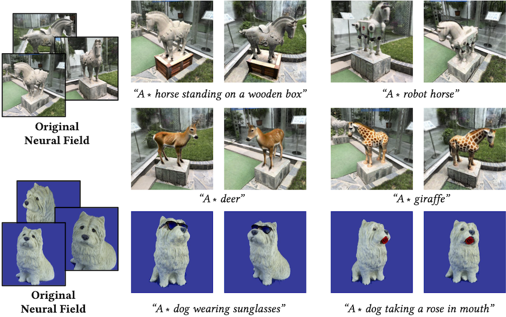
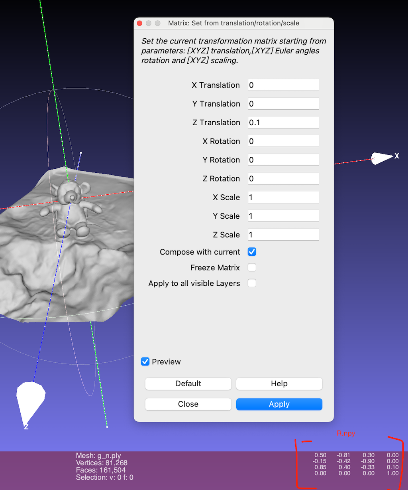

# DreamEditor: Text-Driven 3D Scene Editing with Neural Fields (SIGGRAPH Asia 2023)


<div class="half">
    
</div>


### [Project page](https://www.sysu-hcp.net/projects/cv/111.html) |[Paper](https://arxiv.org/abs/2306.13455) |[Data](https://drive.google.com/drive/folders/12_PlC9cd8ZPg3tXrxJ1m-HKAGYDiahjc?usp=sharing) |[Initial Models](https://drive.google.com/drive/folders/1RHAAv_8IGeH-yTE-DloR3XFPNGfHfUs8?usp=drive_link) |[Edited Models](https://drive.google.com/drive/folders/1byCQcBQYY8wWGvN0DTF7L-9AtgmbkaAC?usp=drive_link) 


## Abstract
>Neural fields have achieved impressive advancements in view synthesis and scene reconstruction. However, editing these neural fields remains challenging due to the implicit encoding of geometry and texture information. In this paper, we propose DreamEditor, a novel framework that enables users to perform controlled editing of neural fields using text prompts. By representing scenes as mesh-based neural fields, DreamEditor allows localized editing within specific regions. DreamEditor utilizes the text encoder of a pretrained text-to-Image diffusion model to automatically identify the regions to be edited based on the semantics of the text prompts. Subsequently, DreamEditor optimizes the editing region and aligns its geometry and texture with the text prompts through score distillation sampling [Poole et al. 2022]. Extensive experiments have demonstrated that DreamEditor can accurately edit neural fields of real-world scenes according to the given text prompts while ensuring consistency in irrelevant areas. DreamEditor generates highly realistic textures and geometry, significantly surpassing previous works in both quantitative and qualitative evaluations.


## Todo 
- [x] **Release training code of step 1,2,3**
- [x] **Release dtu105 initial mesh based-nerf and training scripts**
- [ ] Release all editing samples reported in the paper


## Dependencies
Install with pip:
```
    pip install torch==1.12.1+cu116 torchvision==0.13.1+cu116 torchaudio===0.12.1+cu116
    pip install git+https://github.com/NVlabs/tiny-cuda-nn/#subdirectory=bindings/torch
    pip install diffusers==0.18.2
    pip install huggingface_hub==0.16.4
    pip install open3d==0.17.0 trimesh==3.22.5 pymeshlab
    pip install git+https://github.com/S-aiueo32/contextual_loss_pytorch.git
    
    # install frnn
    git clone --recursive https://github.com/lxxue/FRNN.git
    # install a prefix_sum routine first
    cd FRNN/external/prefix_sum
    pip install .
    
    # install FRNN
    cd ../../ # back to the {FRNN} directory
    # this might take a while since I instantiate all combinations of D and K
    pip install -e .
    # might need to restart the bash to make importing this package work
```


Training requirements
- [Stable Diffusion](https://huggingface.co/models?other=stable-diffusion). We use diffusion prior from a pretrained 2D Stable Diffusion 2.0 model. To start with, you may need a huggingface [token](https://huggingface.co/settings/tokens) to access the model, or use `huggingface-cli login` command.

## Training 


### step1 distillation
You can ignore this step and use the [initial models](https://drive.google.com/drive/folders/1RHAAv_8IGeH-yTE-DloR3XFPNGfHfUs8?usp=drive_link) we provide.
```
    bash run_step1.sh
```

### step2 locating
```
    bash run_step2.sh
```

### step3 editing
```
   bash run_step3.sh
```

### testing
Download [Results](https://drive.google.com/drive/folders/1byCQcBQYY8wWGvN0DTF7L-9AtgmbkaAC?usp=drive_link) and unzip in res_model
```
   bash test.sh
```

### QA
1. How to extract prior mesh?

Answer: 
```
   python train_init_nerf.py -O --workspace ./res/dtu_scan105-grid  --test --save_mesh
```

2. How to get Orient_R.npy?

Answer: We use meshlab to align the pose of the mesh. Click Filters->Normals,Curvatures and Orientation->Matrix: Set from translation\rotation\scale. 
Make sure the Y-axis is vertical and upward to the ground, and the object is oriented in the same direction as the z-axis.
<div class="half">
    
</div>


## Citation
If you find this code helpful for your research, please cite:
```
@article{zhuang2023dreameditor,
  title={DreamEditor: Text-Driven 3D Scene Editing with Neural Fields},
  author={Zhuang, Jingyu and Wang, Chen and Liu, Lingjie and Lin, Liang and Li, Guanbin},
  journal={arXiv preprint arXiv:2306.13455},
  year={2023}
}
```

## Acknowledgments
This code based on [Stable-Dreamfusion](https://github.com/ashawkey/stable-dreamfusion), [Dreambooth](https://huggingface.co/docs/diffusers/training/dreambooth), [DAAM](https://github.com/castorini/daam). 

